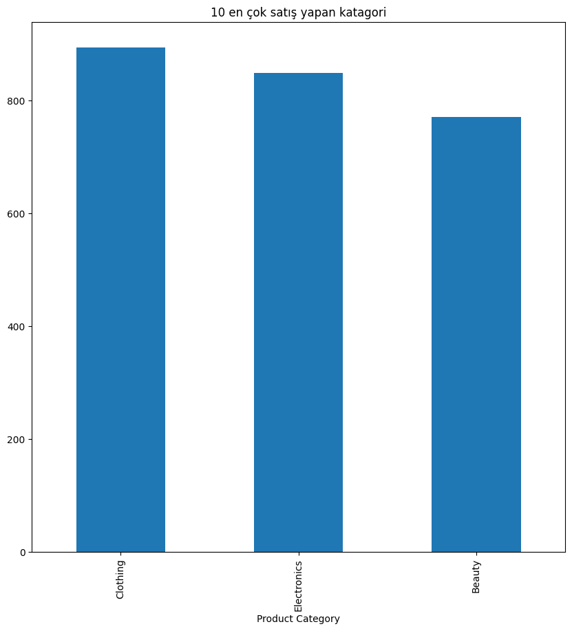
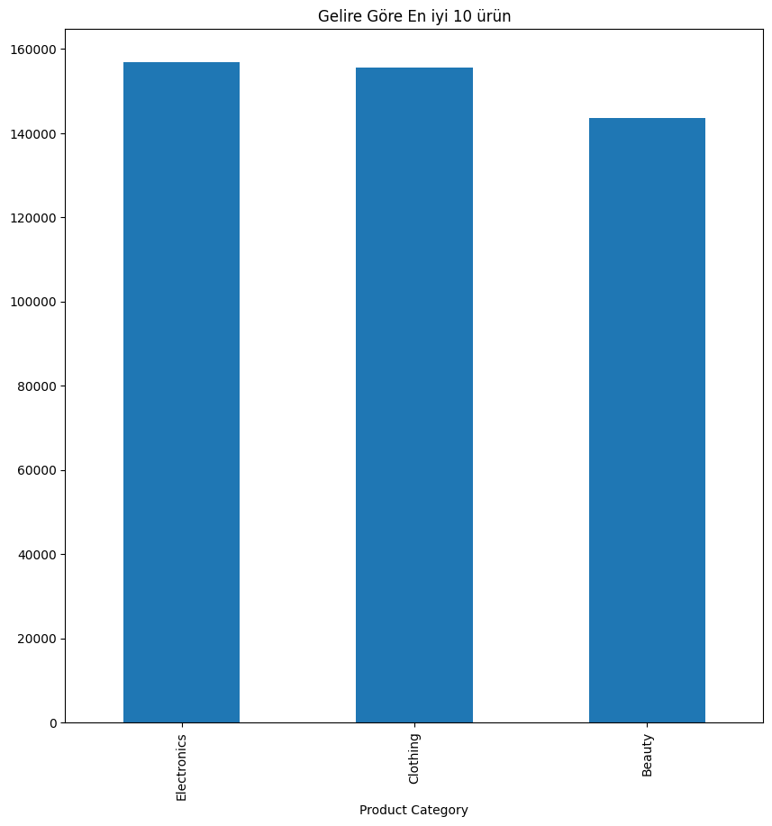
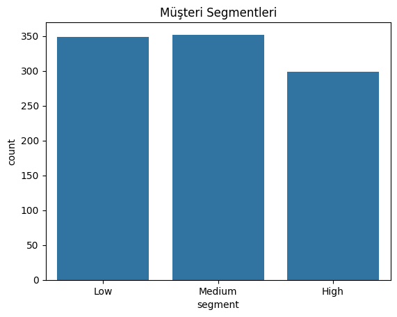

# E-Ticaret Satış Analizi

Proje Amacı
Bu proje, bir e-ticaret mağazasının satış verilerini analiz ederek en çok satan ürünleri, aylık satış trendlerini, haftanın en yoğun satış günlerini ve müşteri segmentlerini görselleştirmeyi amaçlamaktadır.

Veri Hakkında
- Satır sayısı: 1000  
- Kolon sayısı: 9   
- Tarih kolonları `datetime` formatına çevrildi  

Analiz Bulguları

### 3.1 En Çok Satan Ürünler

### 3.2 Aylık Satış Trendleri

### 3.3 Haftanın En Yoğun Satış Günü

### 3.4 Müşteri Segmentasyonu

Sonuç & Öneriler
- En çok satan ürünlerin stok yönetimine öncelik verilmeli.  
- Satışların yoğun olduğu günlerde kampanya ve promosyon stratejileri uygulanabilir.  
- Müşteri segmentasyonu ile hedefli pazarlama yapılabilir.
